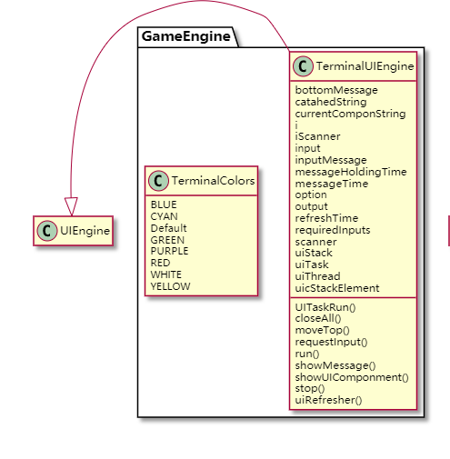
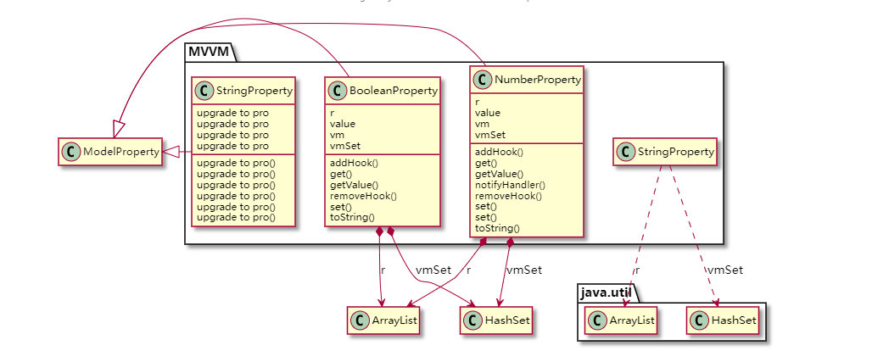
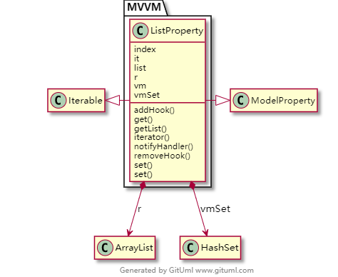
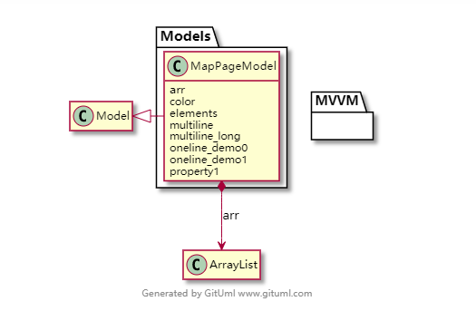
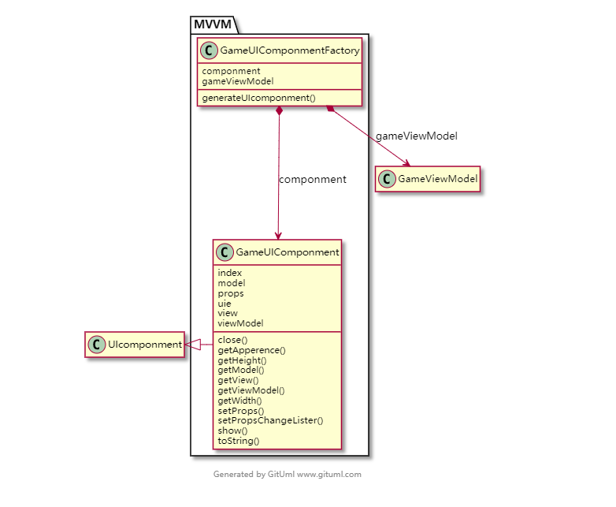
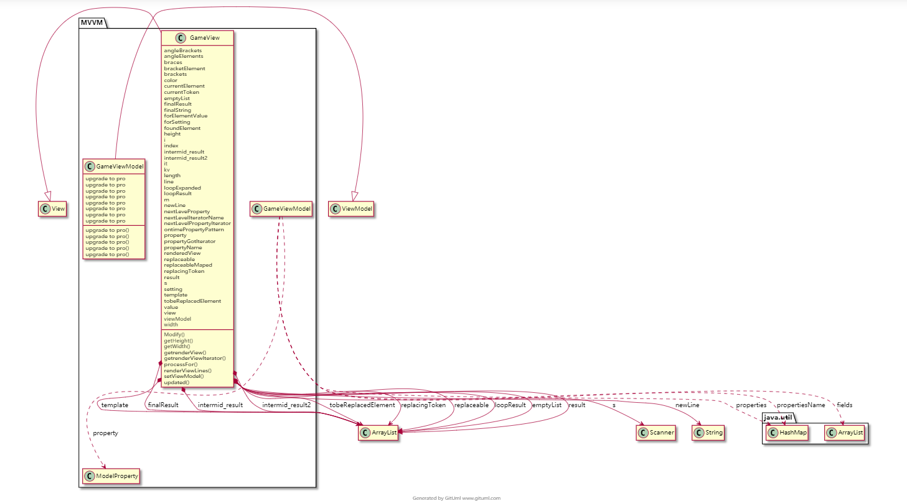
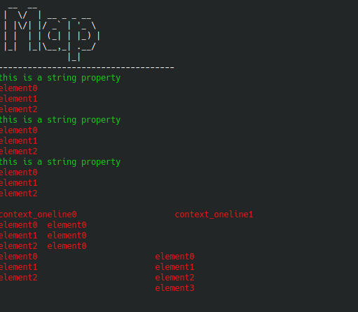

# Hammer_Euv - a Terminal MVVM UI Engine

*if you have a hammer, everything looks like a nail*

Hammer_Euv is a terminal UI engine based on my CS 611 OOD homework 4. The basic idea is I prefer to deal with my assignment tasks by using front-end way/patterns/styles.

*The name `Euv` is an reversion of `Vue`, a famous front-end framework*
## Table of Content
- [Hammer_Euv - a Terminal MVVM UI Engine](#hammer-euv---a-terminal-mvvm-ui-engine)
  * [Artchiture](#artchiture)
    + [Intefaces](#intefaces)
      - [ModelProperty](#modelproperty)
      - [View](#view)
      - [ViewModel](#viewmodel)
      - [Model](#model)
      - [UIEngine](#uiengine)
    + [Classes](#classes)
      - [GameEngine](#gameengine)
      - [Model](#model-1)
      - [UIFactory](#uifactory)
    + [ViewModel](#viewmodel-1)
  * [View Instructions & View Token & View Render](#view-instructions---view-token---view-render)
    + [Static Contents](#static-contents)
    + [element token](#element-token)
      - [color](#color)
      - [max](#max)
      - [min](#min)
    + [Multiline Block](#multiline-block)
    + [Single-line Block](#single-line-block)
    + [Iteration token](#iteration-token)
    + [Overall output](#overall-output)
  * [GameUIComponment](#gameuicomponment)
    + [Show()](#show--)
    + [close()](#close--)
  * [TerminalUIEngine](#terminaluiengine)
    + [Terminal Refresh](#terminal-refresh)
    + [String requestInput(String message,String ... options)](#string-requestinput-string-message-string--options-)
    + [showMessage(String m)](#showmessage-string-m-)
  * [Depoly it in your code](#depoly-it-in-your-code)
    + [Compile Demo Code](#compile-demo-code)
    + [Run Demo Code](#run-demo-code)
  * [TODO & development plan](#todo---development-plan)
  * [Bugs Alerady know](#bugs-alerady-know)
  * [Other things.](#other-things)

<small><i><a href='http://ecotrust-canada.github.io/markdown-toc/'>Table of contents generated with markdown-toc</a></i></small>

## Artchiture
### Intefaces
#### ModelProperty

This interface defines essential methods for two-way binding properties in the model. The ViewModel could use this interface and Reflection(will be introduced later) to interacting all ModelProperty in your Model.

#### View

Defines essential methods for a View.

#### ViewModel

Defines a viewmodel control and logic interface.

#### Model

All model must implement this interface. Even it's an empty interface, It may add some members in the following version

#### UIEngine

UI Engine handles all kinds of stuff related to UI.

### Classes

#### GameEngine



GameEngine package contains TerminalUIEngine implements UIEngine. It also contains predefined Colors for TerminalUIEngine.(ANSI standards)

#### Model


**Observer Pattern**

Every model property has an observer set. The set contains all viewmodels hooked for this property. Once the property has been changed(`Set()`), the hook set will be iterator.

* single line properties



A single line property means the property's get() method could only get an iterator that contains one value.

* Multiline properties




A multiline property means could be output to view in multiline. (This not means it must be output in multiline. `GameView` will only output the first line if a block is defined as an oneline block. (See `view render` following)

**the list properties could not be changed by set(String value) method**
This method will call notify the property changed handlers only.
use `set(List<Object> list)` 
or 
modify the original container and then call this method for sending a notification.

* Model 



This is a simple Model example. The `GameViewModel` will automatically bind each member in a model to a field (which has the same name) in the view.

#### UIFactory

**Factory Pattern**



You need to use this `GameUIComponmentFactory` to generate your GameUIComponment.
Instant your Model, ViewModel, and View, then use the factory to generate your GameUIComponment.

### ViewModel

See`view render`




## View Instructions & View Token & View Render
```
  __  __             
 |  \/  | __ _ _ __  
 | |\/| |/ _` | '_ \ 
 | |  | | (_| | |_) |
 |_|  |_|\__,_| .__/ 
              |_|    
------------------------------------
[e:elements]
<{{property1}},color=(color)>
[e2:elements]
<(e2),color=RED> 
[endfor]
[endfor]

<(oneline_demo0),color=RED,max,min>  <(oneline_demo1),color=RED> 
<{{multiline}},color=RED,max=20>  <(multiline),color=RED> 
<{{multiline}},color=RED,min=30>  <{{multiline_long}},color=RED> 
```

This is a demo view. Contains all token we already have.
### Static Contents
```
  __  __             
 |  \/  | __ _ _ __  
 | |\/| |/ _` | '_ \ 
 | |  | | (_| | |_) |
 |_|  |_|\__,_| .__/ 
              |_|    
------------------------------------
```
The static contents will not be changed in the render process
### element token
```
<{{property1}},color=(color)>
```
An element token will contain values by `,` and the first value must be a Single-line or a  Multiline Block. Element token could define the text color in the Single-line or a  Multiline Block, the maximum length of the output of this token by using `max` and `min`.

color could also be a dynamic single-line block.

#### color 
Possible value:
```
WHITE
RED
GREEN
YELLOW
BLUE
PURPLE
CYAN
```

case sensitivity: NO

Must have a value: YES.

if set an illegal color value, view render will use the default color.

#### max

`max=10` set the maximum length of characters for the block's one line output(in this case, 10 characters). The render will only count the final output for an element token, this means settings(color setting, max setting, min setting) will not be counted in the length. 

**Except you only use the `max`**, in this case, the max length will equal to the length of this element token.

Render will cut from the beginning if the length is exceeded.

case sensitivity: Must a number

Must have a value: NO


#### min


`min=10` set the minimum length of characters for the block's one line output(in this case, 10 characters). The render will only count the final output for an element token, this means settings(color setting, max setting, min setting) will not be counted in the length. 

**Except you only use the `min`**, in this case, the min length will equal to the length of this element token.


Render will add blank to the end.

case sensitivity: Must a number

Must have a value: NO

### Multiline Block
```
<{{property1}},color=(color)>
```

property: property1

Render will iterate the property1 and use the style set in the `element token` to all lines.

If you have more than one multiline block in one line, The render will iterator them together until all property's iterators don't have more elements. Render will try to use fewer lines to do the iterations. If the length of blocks is different, render won't add blanks automatically. See `min` to keep your view pattern.

### Single-line Block
```
<{{property1}},color=(color)>
```

property: color

Render will get the first result of the color property's iterator.

### Iteration token
```
[e2:elements]
<(e2),color=RED> 
[endfor]
```
A typical Iteration block.

Render will iterate the `elements` model property and the value of every iterating loop will be `e2`.

If elements contains `{"element0","element1","element2" }`
The output should be 
```
element0 
element1 
element2 
```
(color doesn't show)

**Every element in that block will be copied on iterating**
(This is also an example for Nested loop)
* `elements = {"element0","element1","element2" }`
* `property1 = "this is a string property"`
* `color = "green"`
```
[e:elements]
<{{property1}},color=(color)>
[e2:elements]
<(e2),color=RED> 
[endfor]
[endfor]
```
The output should be:
```
this is a string property
element0 
element1 
element2 
this is a string property
element0 
element1 
element2 
this is a string property
element0 
element1 
element2 
```
### Overall output
* `elements = {"element0","element1","element2" }`
* `property1 = "this is a string property"`
* `color = "green"`
* `oneline_demo0 = "context_oneline0"`
* `oneline_demo1 = "context_oneline1"`
* `multiline_long = {"element0","element1","element2","element3" }`
```
  __  __             
 |  \/  | __ _ _ __  
 | |\/| |/ _` | '_ \ 
 | |  | | (_| | |_) |
 |_|  |_|\__,_| .__/ 
              |_|    
------------------------------------
this is a string property
element0 
element1 
element2 
this is a string property
element0 
element1 
element2 
this is a string property
element0 
element1 
element2 

context_oneline0                    context_oneline1 
element0  element0 
element1  element0 
element2  element0 
element0                        element0 
element1                        element1 
element2                        element2 
                                element3 
```
(color doesn't show)



## GameUIComponment
GameUIComponment is a core class of the Terminal Engine. Just like web pages on a web browser, GameUIComponments is a similar concept to web pages. 
UIEngine maintains a GameUIComponment stack. The top of the stack is the Component currently showing. 
### Show()
if you show a component, this means you will add the component to the top of the stack, or move this component in the stack to the top.
### close()
if you show a component, this means you will remove the component from the stack.

## TerminalUIEngine
TerminalUIEngine interacts with the console IO streaming.
### Terminal Refresh
The TerminalUIEngine will create a new thread to refresh the console output in 20hz.
###  String requestInput(String message,String ... options)
The method requests input from the user. 
`message` defines the message shown at the bottom
`options` defines correct inputs
The Engine will show the message at the bottom, and also shows the permitted input, for example
```
test for an input(a,b,c)
^                 ^
message           options
```

**due to java limitation, we could give feedback on what the user has typed.**

This method will return until the user input a correct string. (a string contains in options )

### showMessage(String m)

This method will show a notification at the bottom. It will stay there for about 3 seconds.

## Depoly it in your code

An example code:
```java
  //creating ui engine
  TerminalUIEngine uie = new TerminalUIEngine(System.in, System.out);;
  GameView mapView = new GameView(new File("/home/ubuntu/CS611/group/Legend/resources/MapViewTemplete.txt"));
  //create an uicomponment
  MapPageModel mapPageModel = new MapPageModel();
  GameUIComponmentFactory factory = new GameUIComponmentFactory();
  GameUIComponment mapPage = factory.generateUIcomponment(mapPageModel, mapView, null, uie);
  mapPage.show();//show it
  //request a input
  uie.requestInput("test for an input", "a","b","c");
```
### Compile Demo Code
Go to `src/main/java/`
```bash
javac App.java -Xlint:unchecked
```
### Run Demo Code
```bash
java App
```
## TODO & development plan
* add `if` token to allow `conditional rendering`
## Bugs Alerady know

* due to java limitation, we could give feedback on what the user has typed.

## Other things.
One week is really not enough to finish this project. 
